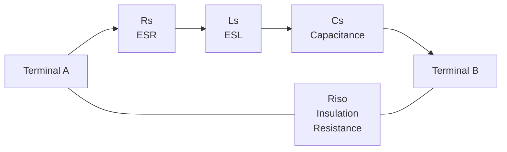
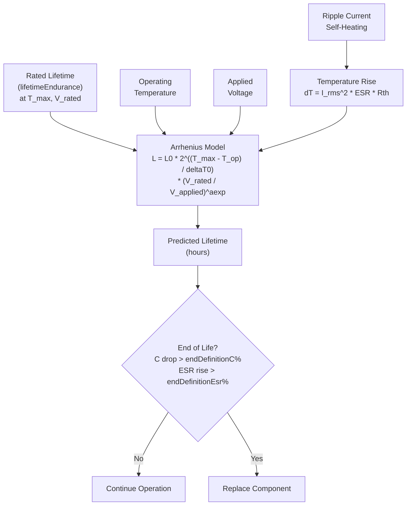
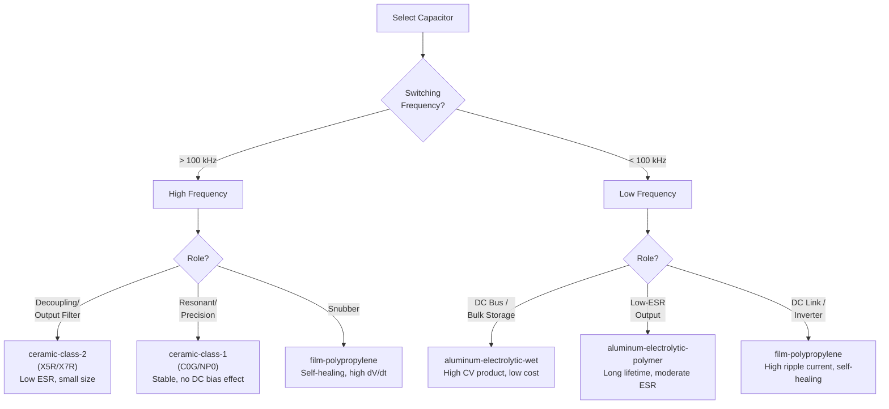

<h1 align="center">CAS - Capacitor Agnostic Structure</h1>

<p align="center">
  <em>The universal data format for capacitor components in power electronics</em>
</p>

<p align="center">
  <a href="https://opensource.org/licenses/MIT"></a>
  <a href="https://json-schema.org/"></a>
</p>

---

## What is CAS?

**CAS is a standardized way to describe capacitor components** used in power electronics -- from tiny MLCCs on a gate driver to large aluminum electrolytics on a DC bus. It defines everything needed to select, simulate, and predict the lifetime of a capacitor in a single, machine-readable JSON document.

CAS is part of the **PEAS (Power Electronics Agnostic Structure)** family of schemas. PEAS is the universal container for any electronic component; CAS, MAS (magnetics), SAS (semiconductors), and RAS (resistors) are its domain-specific children. Every valid CAS document is also a valid PEAS document.

### The Problem CAS Solves

Capacitor selection in power electronics is deceptively complex. You need:

- Rated capacitance, voltage, and ESR from the datasheet
- DC bias derating curves for MLCCs (a 10 uF X5R at rated voltage may only deliver 4 uF)
- Ripple current limits derated by frequency and temperature
- Lifetime predictions under your actual operating conditions (Arrhenius model)
- SPICE model parameters for circuit simulation
- Mechanical dimensions for PCB layout
- Supply chain data for production

This information is scattered across datasheets, manufacturer tools, and spreadsheets. **CAS captures it all in one file.**

### Relationship to PEAS and Sibling Schemas

```
PEAS (Power Electronics Agnostic Structure)
 |-- MAS  (Magnetic Agnostic Structure)      -- inductors, transformers, chokes
 |-- CAS  (Capacitor Agnostic Structure)     -- capacitors (this schema)
 |-- SAS  (Semiconductor Agnostic Structure) -- MOSFETs, diodes, IGBTs
 |-- RAS  (Resistor Agnostic Structure)      -- resistors, varistors
```

A CAS document wraps a `capacitor` object with `inputs` (design requirements + operating points) and `outputs` (an array of per-operating-point results such as ESR losses, thermal rise, and remaining lifetime), forming a complete PEAS document.

### CAS/data/ vs TAS/data/

**Important distinction:** The `CAS/data/` directory stores **manufacturing building blocks** -- raw materials and sub-components such as foils, dielectrics, and electrolyte formulations. **Finished capacitor products** (complete part numbers you can order from a distributor) belong in `TAS/data/`.

---

## Supported Technologies

The `technology` field is a closed 20-value enum (`schemas/capacitor.json#/$defs/technology`). The EIA/MIL dielectric code (X7R, C0G, ...) lives in the separate `dielectricCode` field. The requirements-side `allowedTechnologies` references the **same** enum, so the two vocabularies cannot drift apart.

| Family | `technology` enum values | Typical Applications |
|---|---|---|
| **Ceramic** | `ceramic-class-1`, `ceramic-class-2`, `ceramic-class-3` | Class 1 (C0G/NP0): precision timing, filtering, resonant circuits. Class 2 (X5R/X7R): bulk decoupling, DC link, output filtering -- subject to DC bias derating. Class 3 (Y5U etc.): general purpose. |
| **Aluminum** | `aluminum-electrolytic-wet`, `aluminum-electrolytic-polymer`, `aluminum-hybrid-polymer` | DC bus, bulk energy storage, hold-up; polymer variants for low-ESR output filtering and POL converters. |
| **Tantalum / Niobium** | `tantalum-wet`, `tantalum-mno2`, `tantalum-polymer`, `niobium-oxide` | Stable bulk capacitance, low-profile decoupling. |
| **Film** | `film-polypropylene`, `film-polyester`, `film-polyphenylene-sulfide`, `film-paper`, `film-acrylic` | Snubbers, resonant circuits, DC link in inverters, EMI suppression. Self-healing, high ripple current capability. `film-acrylic` is the PML vapour-deposited acrylate construction (e.g. Rubycon PMLCAP). |
| **Other** | `mica`, `thin-film-silicon`, `supercapacitor-edlc`, `supercapacitor-hybrid`, `vacuum` | RF precision (mica, thin-film silicon), energy buffering (supercaps), high-power RF (vacuum). |

---

## Schema Overview

Every CAS document follows the three-section PEAS pattern:

```
+------------------+     +------------------+     +------------------+
|     INPUTS       |     |    CAPACITOR     |     |    OUTPUTS[]     |
+------------------+     +------------------+     +------------------+
| What you NEED    |  +  | What you SELECT  |  =  | What you GET     |
|                  |     |                  |     | (per op. point)  |
| designRequirements     | - part           |     | - esrLosses      |
|  (capacitance,   |     | - electrical     |     | - temperature    |
|   voltage, role) |     | - thermal        |     | - effectiveCap.  |
| operatingPoints[]|     | - mechanical     |     | - impedance      |
|  (V/I waveforms, |     | - lifetime       |     | - rippleVoltage  |
|   frequency,     |     | - modelParams    |     | - lifetime       |
|   temperature)   |     | - factors        |     | - reliability    |
|                  |     |                  |     | - insulation     |
+------------------+     +------------------+     +------------------+
```

`inputs` is structured: `operatingPoints[]` (PEAS `twoTerminalOperatingPoint`) plus `designRequirements` (capacitance required; optional rated voltage, max ESR, minimum ripple current / lifetime, role, allowed technologies). `outputs` is an **array** of per-operating-point result bundles, each block sealed and carrying `{origin, methodUsed}` provenance.

The `capacitor.manufacturerInfo.datasheetInfo` object is organized into these sections:

| Section | Required | Purpose |
|---|---|---|
| **part** | Yes | Part identification: part number, series, technology, dielectric code, case code |
| **electrical** | Yes | Capacitance (with tolerance), rated voltage, ESR (scalar + curve), dissipation factor (fraction, scalar + curve), Q factor, leakage current, ripple current limits, DC-bias derating points, thermal resistance |
| **thermal** | No | Operating temperature range, temperature coefficient of capacitance (TCC) |
| **mechanical** | Yes | Physical dimensions (diameter, width, length, height, thickness, pin pitch/diameter/length), shape type, assembly type, volume, footprint |
| **lifetime** | No | Endurance hours, lifetime-model parameters, end-of-life definitions, useful life |
| **modelParams** | No | SPICE circuit model: Rs, Cs, Ls, Riso |
| **factors** | No | Ripple current derating curves vs. frequency and temperature |

Only **part**, **electrical**, and **mechanical** are required. There is no `business` section -- commercial data (packaging, MOQ, lead time, stock, pricing) lives in the sibling `distributorsInfo` array (PEAS `distributorInfo`). A `capacitor` may also be a completely empty object `{}`: a pre-sourcing seed whose requirements live in `inputs.designRequirements`.

---

## Key Features

### Lifetime Modeling

CAS includes a complete lifetime model for electrolytic and polymer capacitors (all fields optional/nullable -- MLCCs have no wear-out mechanism). The model parameters are:

| Parameter | Field | Description |
|---|---|---|
| Endurance hours | `lifetimeEndurance` | Rated lifetime at maximum temperature and rated ripple (hours) |
| Maximum lifetime | `maxLifetime` | Absolute maximum lifetime cap (years) |
| A exponent | `aexp` | Voltage stress exponent |
| B exponent | `bexp` | Temperature stress coefficient (Arrhenius) |
| Delta T0 | `deltaT0` | Reference temperature delta for the Arrhenius equation (degrees C) |
| K factor | `kfactor` | Technology-specific lifetime multiplier |
| Vx factor | `vxfactor` | Voltage stress factor |

**End-of-life definitions** specify when a capacitor is considered worn out:

| Field | Description |
|---|---|
| `endDefinitionC` | Capacitance decrease at end of life (percent) |
| `endDefinitionEsr` | ESR increase at end of life (percent) |

**Useful life** fields provide a secondary, more conservative lifetime boundary:

| Field | Description |
|---|---|
| `usefulLife` | Useful life duration (hours) |
| `eoUsefulLifeC` | Capacitance decrease at end of useful life (percent) |
| `eoUsefulLifeR` | Resistance increase at end of useful life (percent) |
| `usefulLifeComment` | Additional notes on useful life conditions |

### Ripple Current Derating

Capacitor ripple current capability varies with frequency and temperature. CAS provides two derating mechanisms:

**In the `electrical` section** -- point-form curves attached directly to the part:

- `rippleCurrentFrequencyPoints` -- X-Y curve of ripple current derating vs. frequency
- `rippleCurrentTemperaturePoints` -- X-Y curve of ripple current derating vs. temperature

**In the `factors` section** -- normalized derating multipliers:

- `rippleCurrentFrequencyFactorFrequency` / `rippleCurrentFrequencyFactorAmplitude` -- frequency derating curve (multiply rated ripple current by the factor at your switching frequency)
- `rippleCurrentTemperatureFactorTemperature` / `rippleCurrentTemperatureFactorAmplitude` -- temperature derating curve (multiply rated ripple current by the factor at your ambient temperature)

The `electrical` section also records the reference conditions:
- `rippleCurrentFrequency` -- frequency at which rated ripple current is specified (Hz)
- `rippleCurrentTemperature` -- temperature at which rated ripple current is specified (degrees C)

### Frequency-Dependent ESR and DF

Scalar `esr`/`dissipationFactor` values (with their measurement frequencies) are kept for legacy datasheet points, but selection logic should prefer the curve fields when present:

- `esrPoints` -- ESR vs. frequency (at mains frequencies ESR can be 10-100x its 100 kHz value for class-2 ceramic and polymer chemistries)
- `dissipationFactorPoints` -- tan delta vs. frequency, as a **fraction** (0.025 = 2.5%)

### SPICE Model

The `modelParams` section provides a four-element circuit model suitable for SPICE simulation:

```
        Rs          Ls          Cs
  o----/\/\/----UUUU--------||------o
  |                                 |
  |              Riso               |
  o--------------/\/\/--------------o
```

| Parameter | Field | Unit | Description |
|---|---|---|---|
| Series resistance | `rs` | Ohms | ESR at the model frequency |
| Series capacitance | `cs` | Farads | Effective capacitance |
| Series inductance | `ls` | Henries | ESL (equivalent series inductance) |
| Insulation resistance | `riso` | Ohms | Parallel leakage path (very high value) |

This is a series RLC model (Rs + Ls + Cs in series between the terminals) with a parallel insulation resistance (Riso) across the terminals. It captures impedance behavior from DC through the self-resonant frequency and beyond.



### Lifetime Calculation Flow



### Capacitor Technology Decision Tree



---

## Utility Types

CAS uses the shared utility types defined in `PEAS/schemas/utils.json` (referenced by absolute `$id`; `CAS/schemas/utils.json` is just a redirect shim):

### dimensionWithTolerance

Represents a physical quantity with tolerance bounds. At least one of `minimum`/`nominal`/`maximum` must be present (plus optional `excludeMinimum`, `excludeMaximum`, `unit`):

```json
{
  "minimum": 9.5e-6,
  "nominal": 10e-6,
  "maximum": 10.5e-6
}
```

Used for: capacitance, temperature range, TCC, all mechanical dimensions, volume, footprint.

### curve

X-Y data points for characteristic curves (optional `xLabel`, `yLabel`, `conditions`):

```json
{
  "xData": [100, 1000, 10000, 100000],
  "yData": [0.5, 0.7, 1.0, 1.2]
}
```

Used for: ripple current derating curves, `esrPoints`, `dissipationFactorPoints`.

### numberArray

A simple array of numbers, used for the factor curves in the `factors` section.

---

## Examples

Both examples below are trimmed versions of the full documents in `examples/`, which validate against `schemas/CAS.json` (and as PEAS documents).

### MLCC Class 2 (X7R) -- `examples/01_mlcc_grm32_1uF.json`

```json
{
  "inputs": {
    "designRequirements": {
      "name": "output filter MLCC",
      "capacitance": {"nominal": 1e-06},
      "ratedVoltage": 100.0,
      "role": "outputFilter",
      "allowedTechnologies": ["ceramic-class-2"],
      "market": "industrial"
    },
    "operatingPoints": [
      {
        "name": "500kHz ripple, 25C",
        "conditions": {"ambientTemperature": 25.0},
        "excitation": {
          "frequency": 500000.0,
          "voltage": {"processed": {"label": "sinusoidal", "offset": 0.0, "rms": 2.0, "peak": 2.83}},
          "current": {"processed": {"label": "sinusoidal", "offset": 0.0, "rms": 0.5, "peak": 0.71}}
        }
      }
    ]
  },
  "capacitor": {
    "manufacturerInfo": {
      "name": "Murata",
      "datasheetUrl": "https://www.murata.com/products/productdata/GRM.pdf",
      "datasheetInfo": {
        "part": {
          "partNumber": "GRM32ER72A105KA35L",
          "series": "GRM",
          "technology": "ceramic-class-2",
          "case": "1210"
        },
        "electrical": {
          "capacitance": {"nominal": 1e-06, "minimum": 9e-07, "maximum": 1.1e-06},
          "ratedVoltage": 100,
          "dissipationFactor": 0.025,
          "dissipationFactorFrequency": 1000,
          "esr": 0.05,
          "esrFrequency": 1000000,
          "rippleCurrent": 0.5,
          "rippleCurrentFrequency": 1000000,
          "rippleCurrentTemperature": 25,
          "thermalResistance": 50
        },
        "thermal": {
          "temperature": {"minimum": -55, "nominal": 25, "maximum": 125},
          "tcc": {"minimum": -15, "nominal": 0, "maximum": 15}
        },
        "mechanical": {
          "dimensions": {
            "width": {"nominal": 0.0025},
            "length": {"nominal": 0.0032},
            "height": {"nominal": 0.0025}
          },
          "shape": {"assembly": "SMT", "shapeType": "SMD Chip", "footprint": {"nominal": 8e-06}}
        },
        "lifetime": {"usefulLifeComment": "MLCC - no wear-out mechanism"},
        "modelParams": {"rs": 0.05, "cs": 1e-06, "ls": 1.2e-09, "riso": 1e10},
        "provenance": [
          {
            "source": "manufacturerParametric",
            "sourceName": "Murata parametric (SimSurfing export)",
            "retrievedDate": "2026-06-20"
          }
        ]
      }
    },
    "distributorsInfo": [
      {
        "name": "Broad",
        "packaging": "Tape and Reel",
        "moq": 4000,
        "vpe": 4000,
        "leadTime": 12,
        "cost": {"value": 0.08, "currency": "USD"}
      }
    ]
  },
  "outputs": []
}
```

Note the `dissipationFactor` of `0.025`: a **fraction** (2.5%), not a percentage. Commercial data (packaging, MOQ, cost) sits in `distributorsInfo`, not inside `datasheetInfo`.

### Aluminum Electrolytic -- `examples/02_alu_electrolytic_upw.json`

```json
{
  "inputs": {
    "designRequirements": {
      "name": "bulk storage electrolytic",
      "capacitance": {"nominal": 0.001},
      "ratedVoltage": 50.0,
      "minimumRippleCurrent": 1.0,
      "minimumLifetime": 8000.0,
      "role": "dcLink",
      "allowedTechnologies": ["aluminum-electrolytic-wet", "aluminum-hybrid-polymer"]
    },
    "operatingPoints": [
      {
        "name": "100Hz mains ripple, 45C",
        "conditions": {"ambientTemperature": 45.0},
        "excitation": {
          "frequency": 100.0,
          "voltage": {"processed": {"label": "sinusoidal", "offset": 0.0, "rms": 3.0, "peak": 4.24}},
          "current": {"processed": {"label": "sinusoidal", "offset": 0.0, "rms": 1.2, "peak": 1.7}}
        }
      }
    ]
  },
  "capacitor": {
    "manufacturerInfo": {
      "name": "Nichicon",
      "datasheetUrl": "https://www.nichicon.co.jp/english/products/pdfs/UPW1H102MHD.pdf",
      "datasheetInfo": {
        "part": {
          "partNumber": "UPW1H102MHD",
          "series": "UPW",
          "technology": "aluminum-electrolytic-wet",
          "case": "16x25"
        },
        "electrical": {
          "capacitance": {"nominal": 0.001, "minimum": 0.0008, "maximum": 0.0012},
          "capacitanceDriftLongTermPercent": 20,
          "ratedVoltage": 50,
          "dissipationFactor": 0.1,
          "dissipationFactorFrequency": 120,
          "leakageCurrent": 0.0015,
          "esr": 0.034,
          "esrFrequency": 100000,
          "rippleCurrent": 2.235,
          "rippleCurrentFrequency": 100000,
          "rippleCurrentTemperature": 105
        },
        "thermal": {
          "temperature": {"minimum": -55, "maximum": 105}
        },
        "mechanical": {
          "dimensions": {
            "diameter": {"nominal": 0.016},
            "length": {"nominal": 0.025},
            "pitch": {"nominal": 0.0075},
            "pinDiameter": {"nominal": 0.0008}
          },
          "shape": {"assembly": "THT", "shapeType": "Radial Cylindrical"}
        },
        "lifetime": {
          "lifetimeEndurance": 8000,
          "aexp": 2.0,
          "deltaT0": 10.0,
          "endDefinitionC": 20,
          "endDefinitionEsr": 200
        },
        "factors": {
          "rippleCurrentFrequencyFactorFrequency": [50, 120, 300, 1000, 10000, 100000],
          "rippleCurrentFrequencyFactorAmplitude": [0.7, 0.75, 0.8, 0.9, 1.0, 1.0],
          "rippleCurrentTemperatureFactorTemperature": [60, 85, 95, 105],
          "rippleCurrentTemperatureFactorAmplitude": [1.6, 1.2, 1.05, 1.0]
        },
        "provenance": [
          {
            "source": "manufacturerDatasheet",
            "sourceName": "Nichicon datasheet (nichicon.co.jp)"
          }
        ]
      }
    },
    "distributorsInfo": [
      {"name": "Mouser/DigiKey", "packaging": "Bulk", "moq": 1, "vpe": 200}
    ]
  },
  "outputs": []
}
```

---

## File Structure

```
CAS/
  schemas/
    CAS.json                        -- Top-level schema (inputs + capacitor + outputs[], all required)
    capacitor.json                  -- Capacitor component schema (incl. the technology enum)
    inputs.json                     -- operatingPoints[] + designRequirements
    inputs/
      designRequirements.json       -- Capacitor design requirements (capacitance required)
    outputs.json                    -- Per-operating-point result blocks (sealed, with provenance)
    utils.json                      -- Redirect shim to PEAS/schemas/utils.json
  data/
    capacitors.ndjson               -- Manufacturing building blocks (foils, dielectrics, etc.)
    eia_dielectric_codes.json       -- EIA dielectric-code reference data
  examples/
    01_mlcc_grm32_1uF.json          -- Murata MLCC (ceramic-class-2)
    02_alu_electrolytic_upw.json    -- Nichicon aluminum electrolytic
  docs/
    schema.md                       -- Detailed field-by-field schema reference
```

---

## License

This project is licensed under the MIT License -- see the [LICENSE](LICENSE) file.

---

<p align="center">
  Part of the <a href="https://github.com/OpenConverters">OpenConverters</a> project
</p>
