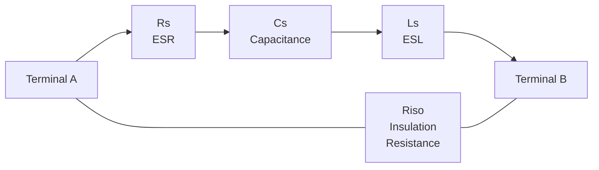
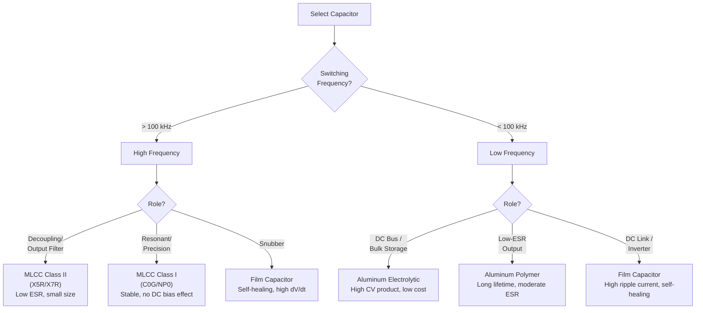

<h1 align="center">CAS - Capacitor Agnostic Structure</h1>

<p align="center">
  <em>The universal data format for capacitor components in power electronics</em>
</p>

<p align="center">
  <a href="https://opensource.org/licenses/MIT"></a>
  <a href="https://json-schema.org/"></a>
</p>

---

## What is CAS?

**CAS is a standardized way to describe capacitor components** used in power electronics -- from tiny MLCCs on a gate driver to large aluminum electrolytics on a DC bus. It defines everything needed to select, simulate, and predict the lifetime of a capacitor in a single, machine-readable JSON document.

CAS is part of the **EAS (Electronic Agnostic Structure)** family of schemas. EAS is the universal container for any electronic component; CAS, MAS (magnetics), SAS (semiconductors), and RAS (resistors) are its domain-specific children. Every valid CAS document is also a valid EAS document.

### The Problem CAS Solves

Capacitor selection in power electronics is deceptively complex. You need:

- Rated capacitance, voltage, and ESR from the datasheet
- DC bias derating curves for MLCCs (a 10 uF X5R at rated voltage may only deliver 4 uF)
- Ripple current limits derated by frequency and temperature
- Lifetime predictions under your actual operating conditions (Arrhenius model)
- SPICE model parameters for circuit simulation
- Mechanical dimensions for PCB layout
- Supply chain data for production

This information is scattered across datasheets, manufacturer tools, and spreadsheets. **CAS captures it all in one file.**

### Relationship to EAS and Sibling Schemas

```
EAS (Electronic Agnostic Structure)
 |-- MAS  (Magnetic Agnostic Structure)      -- inductors, transformers, chokes
 |-- CAS  (Capacitor Agnostic Structure)     -- capacitors (this schema)
 |-- SAS  (Semiconductor Agnostic Structure) -- MOSFETs, diodes, IGBTs
 |-- RAS  (Resistor Agnostic Structure)      -- resistors
```

A CAS document wraps a `capacitor` object with `inputs` (operating conditions) and `outputs` (computed results such as ESR losses, thermal rise, and remaining lifetime), forming a complete EAS document.

### CAS/data/ vs TAS/data/

**Important distinction:** The `CAS/data/` directory stores **manufacturing building blocks** -- raw materials and sub-components such as foils, dielectrics, and electrolyte formulations. **Finished capacitor products** (complete part numbers you can order from a distributor) belong in `TAS/data/`.

---

## Supported Technologies

CAS supports all major capacitor technologies used in power electronics:

| Technology | `technology` enum value | Typical Applications |
|---|---|---|
| **MLCC Class I** | `"MLCC Class I"` | C0G/NP0 -- precision timing, filtering, resonant circuits. Stable capacitance vs. voltage and temperature. |
| **MLCC Class II** | `"MLCC Class II"` | X5R/X7R/X7S -- bulk decoupling, DC link, output filtering. Subject to DC bias derating. |
| **Aluminum Electrolytic** | `"Alum. Electrolytic"` | DC bus, bulk energy storage, hold-up time. High CV product, limited ripple current and lifetime. |
| **Aluminum Polymer** | `"Alum. Polymer"` | Low-ESR output filtering, POL converters. Long lifetime, higher cost. |
| **Hybrid Polymer** | `"Hybrid Polymer"` | Combines electrolytic and polymer advantages. Moderate ESR with extended lifetime. |
| **Film Capacitor** | `"Film Capacitor"` | Snubbers, resonant circuits, DC link in inverters. Self-healing, high ripple current capability. |

---

## Schema Overview

Every CAS document follows the three-section EAS pattern:

```
+------------------+     +------------------+     +------------------+
|     INPUTS       |     |    CAPACITOR     |     |    OUTPUTS       |
+------------------+     +------------------+     +------------------+
| What you NEED    |  +  | What you SELECT  |  =  | What you GET     |
|                  |     |                  |     |                  |
| - Voltage/Current|     | - part           |     | - ESR losses     |
| - Frequency      |     | - electrical     |     | - Temperature    |
| - Temperature    |     | - thermal        |     | - Lifetime       |
| - Lifetime req.  |     | - mechanical     |     | - Impedance      |
|                  |     | - business       |     |                  |
|                  |     | - lifetime       |     |                  |
|                  |     | - modelParams    |     |                  |
|                  |     | - factors        |     |                  |
+------------------+     +------------------+     +------------------+
```

The `capacitor` object is organized into eight sections:

| Section | Purpose |
|---|---|
| **part** | Part identification: part number, series, technology, case code |
| **electrical** | Capacitance (with tolerance), rated voltage, ESR, dissipation factor, leakage current, ripple current limits, thermal resistance, MLCC DC bias parameters |
| **thermal** | Operating temperature range (with tolerance), temperature coefficient of capacitance (TCC) |
| **mechanical** | Physical dimensions (diameter, width, length, height, pin pitch, pin diameter, pin length), shape type, assembly type, volume, footprint |
| **business** | Packaging, MOQ, lead time, stock, pricing, distribution channel |
| **lifetime** | Endurance hours, Arrhenius model parameters, end-of-life definitions, useful life |
| **modelParams** | SPICE circuit model: Rs, Cs, Ls, Riso |
| **factors** | Ripple current derating curves vs. frequency and temperature |

All eight sections are **required**.

---

## Key Features

### Lifetime Modeling

CAS includes a complete Arrhenius-based lifetime model for electrolytic and polymer capacitors. The model parameters are:

| Parameter | Field | Description |
|---|---|---|
| Endurance hours | `lifetimeEndurance` | Rated lifetime at maximum temperature and rated ripple (hours) |
| Maximum lifetime | `maxLifetime` | Absolute maximum lifetime cap (years) |
| A exponent | `aexp` | Temperature acceleration exponent |
| B exponent | `bexp` | Voltage acceleration exponent |
| Delta T0 | `deltaT0` | Reference temperature delta for the Arrhenius equation (degrees C) |
| K factor | `kfactor` | Technology-specific lifetime multiplier |
| Vx factor | `vxfactor` | Voltage stress factor |

**End-of-life definitions** specify when a capacitor is considered worn out:

| Field | Description |
|---|---|
| `endDefinitionC` | Capacitance decrease at end of life (percent) |
| `endDefinitionEsr` | ESR increase at end of life (percent) |

**Useful life** fields provide a secondary, more conservative lifetime boundary:

| Field | Description |
|---|---|
| `usefulLife` | Useful life duration (hours) |
| `eoUsefulLifeC` | Capacitance decrease at end of useful life (percent) |
| `eoUsefulLifeR` | Resistance increase at end of useful life (percent) |
| `usefulLifeComment` | Additional notes on useful life conditions |

### MLCC DC Bias Derating

MLCC Class II capacitors (X5R, X7R, etc.) lose capacitance as DC bias voltage increases. CAS captures this with two fields in the `electrical` section:

| Field | Description |
|---|---|
| `capacitanceSaturationMLCC` | Saturation capacitance value (the capacitance at which DC bias derating flattens out) |
| `vthMLCC` | Threshold voltage at which significant capacitance loss begins (Volts) |

These fields are `null` for non-MLCC technologies.

### Ripple Current Derating

Capacitor ripple current capability varies with frequency and temperature. CAS provides two derating mechanisms:

**In the `electrical` section** -- point-form curves attached directly to the part:

- `rippleCurrentFrequencyPoints` -- X-Y curve of ripple current vs. frequency
- `rippleCurrentTemperaturePoints` -- X-Y curve of ripple current vs. temperature

**In the `factors` section** -- normalized derating multipliers:

- `rippleCurrentFrequencyFactorFrequency` / `rippleCurrentFrequencyFactorAmplitude` -- frequency derating curve (multiply rated ripple current by the factor at your switching frequency)
- `rippleCurrentTemperatureFactorTemperature` / `rippleCurrentTemperatureFactorAmplitude` -- temperature derating curve (multiply rated ripple current by the factor at your ambient temperature)

The `electrical` section also records the reference conditions:
- `rippleCurrentFrequency` -- frequency at which rated ripple current is specified (Hz)
- `rippleCurrentTemperature` -- temperature at which rated ripple current is specified (degrees C)

### SPICE Model

The `modelParams` section provides a four-element circuit model suitable for SPICE simulation:

```
        Rs          Ls
  o----/\/\/----UUUU----o
  |                     |
  |        Cs           |
  o-------||------------o
  |                     |
  |       Riso          |
  o----/\/\/------------o
```

| Parameter | Field | Unit | Description |
|---|---|---|---|
| Series resistance | `rs` | Ohms | ESR at the model frequency |
| Series capacitance | `cs` | Farads | Effective capacitance |
| Series inductance | `ls` | Henries | ESL (equivalent series inductance) |
| Insulation resistance | `riso` | Ohms | Parallel leakage path (very high value) |

This is a series RLC model (Rs + Cs + Ls in series between the terminals) with a parallel insulation resistance (Riso) across the terminals. It captures impedance behavior from DC through the self-resonant frequency and beyond.



### Lifetime Calculation Flow


### Capacitor Technology Decision Tree



---

## Utility Types

CAS uses shared utility types defined in `schemas/utils.json`:

### dimensionWithTolerance

Represents a physical quantity with tolerance bounds. At least one of the three fields must be present:

```json
{
  "minimum": 9.5e-6,
  "nominal": 10e-6,
  "maximum": 10.5e-6
}
```

Used for: capacitance, temperature range, TCC, all mechanical dimensions, volume, footprint.

### curve

X-Y data points for characteristic curves:

```json
{
  "xData": [100, 1000, 10000, 100000],
  "yData": [0.5, 0.7, 1.0, 1.2]
}
```

Used for: ripple current derating curves (frequency and temperature).

### numberArray

A simple array of numbers, used for the factor curves in the `factors` section.

---

## Examples

### Aluminum Electrolytic Capacitor

```json
{
  "inputs": {},
  "capacitor": {
    "manufacturerInfo": {
      "datasheetInfo": {
        "part": {
          "partNumber": "860010672009",
          "series": "WCAP-ASLI",
          "technology": "Alum. Electrolytic",
          "matchcodeDescription": "22uF 50V 105C Radial",
          "case": "6.3x5.5",
          "useInDcTool": true,
          "internalViewOnly": null
        },
        "electrical": {
          "capacitance": {"nominal": 22e-6},
          "capacitanceDriftLongTermPercent": -20,
          "capacitanceMinimumLongTerm": 17.6e-6,
          "ratedVoltage": 50,
          "dissipationFactor": 16,
          "dissipationFactorFrequency": 120,
          "leakageCurrent": 5.5e-6,
          "insulationResistance": 4e8,
          "esr": 2.7,
          "esrFrequency": 100000,
          "esrForLosses": 2.7,
          "rippleCurrent": 0.12,
          "rippleCurrentFrequency": 100000,
          "rippleCurrentTemperature": 105,
          "rippleCurrentFrequencyPoints": {"xData": [], "yData": []},
          "rippleCurrentTemperaturePoints": {"xData": [], "yData": []},
          "thermalResistance": null,
          "capacitanceSaturationMLCC": null,
          "vthMLCC": null
        },
        "thermal": {
          "temperature": {"minimum": -40, "nominal": 25, "maximum": 105},
          "tcc": null
        },
        "mechanical": {
          "dimensions": {
            "diameter": {"nominal": 0.0063},
            "width": null,
            "length": null,
            "height": {"nominal": 0.0055},
            "pitch": {"nominal": 0.0025},
            "pinDiameter": {"nominal": 0.0005},
            "pinLength": null
          },
          "shape": {
            "assembly": "THT",
            "shapeType": "Radial Cylindrical",
            "volume": null,
            "footprint": null
          }
        },
        "business": {
          "packaging": "Bulk",
          "vpe": 500,
          "moq": 500,
          "leadTime": null,
          "stock": null,
          "distribution": null,
          "wgu": "0090",
          "alphaPlanDescription": "WCAP-ASLI 22uF 50V",
          "priceCost": 0.05,
          "weCustomWeight": 0.8
        },
        "lifetime": {
          "lifetimeEndurance": 2000,
          "maxLifetime": 15,
          "aexp": 2,
          "bexp": 1,
          "deltaT0": 10,
          "kfactor": 1,
          "vxfactor": 1,
          "endDefinitionC": -20,
          "endDefinitionEsr": 200,
          "usefulLife": null,
          "eoUsefulLifeC": null,
          "eoUsefulLifeR": null,
          "usefulLifeComment": null
        },
        "modelParams": {
          "rs": 2.7,
          "cs": 22e-6,
          "ls": 10e-9,
          "riso": 4e8
        },
        "factors": {
          "rippleCurrentFrequencyFactorFrequency": [120, 1000, 10000, 100000],
          "rippleCurrentFrequencyFactorAmplitude": [0.5, 0.65, 0.85, 1.0],
          "rippleCurrentTemperatureFactorTemperature": [60, 85, 105],
          "rippleCurrentTemperatureFactorAmplitude": [1.5, 1.0, 0.0]
        }
      }
    }
  },
  "outputs": {}
}
```

### MLCC Class II (X7R)

```json
{
  "inputs": {},
  "capacitor": {
    "manufacturerInfo": {
      "datasheetInfo": {
        "part": {
          "partNumber": "885012207098",
          "series": "WCAP-CSGP",
          "technology": "MLCC Class II",
          "matchcodeDescription": "10uF 25V X7R 1210",
          "case": "1210",
          "useInDcTool": true,
          "internalViewOnly": null
        },
        "electrical": {
          "capacitance": {"minimum": 8e-6, "nominal": 10e-6, "maximum": 12e-6},
          "capacitanceDriftLongTermPercent": -5,
          "capacitanceMinimumLongTerm": 7.6e-6,
          "ratedVoltage": 25,
          "dissipationFactor": 10,
          "dissipationFactorFrequency": 1000,
          "leakageCurrent": 2.5e-7,
          "insulationResistance": 1e10,
          "esr": 0.005,
          "esrFrequency": 1000000,
          "esrForLosses": 0.005,
          "rippleCurrent": 3.0,
          "rippleCurrentFrequency": 100000,
          "rippleCurrentTemperature": 25,
          "rippleCurrentFrequencyPoints": {"xData": [], "yData": []},
          "rippleCurrentTemperaturePoints": {"xData": [], "yData": []},
          "thermalResistance": 50,
          "capacitanceSaturationMLCC": 4e-6,
          "vthMLCC": 12.5
        },
        "thermal": {
          "temperature": {"minimum": -55, "nominal": 25, "maximum": 125},
          "tcc": {"minimum": -15, "maximum": 15}
        },
        "mechanical": {
          "dimensions": {
            "diameter": null,
            "width": {"nominal": 0.0032},
            "length": {"nominal": 0.0025},
            "height": {"nominal": 0.0025},
            "pitch": null,
            "pinDiameter": null,
            "pinLength": null
          },
          "shape": {
            "assembly": "SMT",
            "shapeType": "SMD Chip",
            "volume": null,
            "footprint": null
          }
        },
        "business": {
          "packaging": "Tape & Reel",
          "vpe": 4000,
          "moq": 4000,
          "leadTime": null,
          "stock": null,
          "distribution": null,
          "wgu": "0090",
          "alphaPlanDescription": "WCAP-CSGP 10uF 25V X7R",
          "priceCost": 0.03,
          "weCustomWeight": 0.3
        },
        "lifetime": {
          "lifetimeEndurance": null,
          "maxLifetime": null,
          "aexp": null,
          "bexp": null,
          "deltaT0": null,
          "kfactor": null,
          "vxfactor": null,
          "endDefinitionC": null,
          "endDefinitionEsr": null,
          "usefulLife": null,
          "eoUsefulLifeC": null,
          "eoUsefulLifeR": null,
          "usefulLifeComment": null
        },
        "modelParams": {
          "rs": 0.005,
          "cs": 10e-6,
          "ls": 1e-9,
          "riso": 1e10
        },
        "factors": {
          "rippleCurrentFrequencyFactorFrequency": [],
          "rippleCurrentFrequencyFactorAmplitude": [],
          "rippleCurrentTemperatureFactorTemperature": [],
          "rippleCurrentTemperatureFactorAmplitude": []
        }
      }
    }
  },
  "outputs": {}
}
```

---

## File Structure

```
CAS/
  schemas/
    CAS.json          -- Top-level schema (inputs + capacitor + outputs)
    capacitor.json    -- Capacitor component schema (all eight sections)
    utils.json        -- Shared types: dimensionWithTolerance, curve, numberArray
  data/
    capacitors.ndjson -- Manufacturing building blocks (foils, dielectrics, etc.)
  examples/           -- Example CAS documents
  docs/
    schema.md         -- Detailed field-by-field schema reference
```

---

## License

This project is licensed under the MIT License.

---

<p align="center">
  Part of the <a href="https://github.com/OpenConverters">OpenConverters</a> project
</p>
